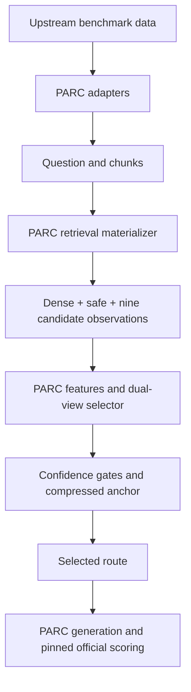

# PARC: Prediction-Free Adaptive Routing and Chunk Compression

[](https://github.com/anning945/PARC/actions/workflows/tests.yml)
[](LICENSE)

[English](#overview) | [中文说明](#中文说明)

PARC selects a compressed chunk-pool view for each retrieval-augmented
generation query, using retrieval observations rather than generated answers.
This repository releases the frozen router, selector-training code, complete
retrieval/generation/official-scoring pipeline, benchmark adapters, synthetic
examples, and score-only experiment summaries.

## Contents

- [Overview](#overview)
- [Installation](#installation)
- [Quick start](#quick-start)
- [Datasets](#datasets)
- [Development split and selection protocol](docs/development_inventory.md)
- [Run on your retrieval observations](#run-on-your-retrieval-observations)
- [Train the selector](#train-the-selector)
- [Reported results](#reported-results)
- [Repository structure](#repository-structure)
- [Troubleshooting](#troubleshooting)
- [Citation and license](#citation-and-license)
- [中文说明](#中文说明)

## Overview

PARC combines a nine-route compression portfolio, raw and relative retrieval
features, a frozen dual-view selector, confidence gates, and a compressed
Dense-order anchor. At inference, routing does not consume test answers,
generator outputs, quality scores, benchmark identities, or generator
identities. "Prediction-free" means no trial-answer generation for routing
at inference; the selector still predicts route utility. It is not
training-free: development F1 differences supervise the selector, while
Qwen and Llama are not fine-tuned.

The [current paper scope](docs/current_paper_results.md) contains 35 tasks from
ETHIC, HELMET, and LongTableBench, with 11,997 scored units. The
[development inventory](docs/development_inventory.md) documents the 12
development tasks, source revisions, and selection rules. The
[selection protocol](docs/selection_protocol.md) explains
the retained pool's role, heuristic route budgets, and exact 144-policy
development objective. Both have machine-readable metadata in `configs/`.



| Component | Release status |
| --- | --- |
| Frozen selector, feature extraction, routing and checksums | Included |
| Benchmark adapters and inventory schema checks | Included |
| CPU synthetic example and automated contract tests | Included |
| Current 35-task cross-model results | Included |
| Current-scope aggregation and manifest validation | Included; supports complete new replay outputs |
| Development feature preparation, selector fitting and LOTO/LOFO policy selection | Included; requires materialized retrieval observations and development F1 labels |
| Separate routing entry point for locally trained selectors | Included; does not replace the paper artifact |
| Retrieval materializer for Dense, safe and all nine routes | Included |
| Generator runner, prompt packing and official-scoring orchestration | Included |

The complete pipeline is public, while the quick start remains a CPU-only
routing check that needs no dataset, API key, or generator checkpoint. An
end-to-end run uses upstream datasets, model weights, and inventory validation. See the
[end-to-end guide](docs/end_to_end_pipeline.md) and [release boundaries](docs/release_boundary.md).

## Installation

Requirements: Git, Bash, Python **3.10.20**, and pip. Use Linux or macOS; on
Windows, run the shell scripts in WSL. GPU requirements depend on your external
retrieval/generation stack, not the routing example.

```bash
git clone https://github.com/anning945/PARC.git
cd PARC
conda env create -f environment.yml
conda activate parc-routing
```

Alternatively, with Python 3.10.20 already installed:

```bash
python3.10 -m venv .venv
source .venv/bin/activate
python -m pip install -r requirements-benchmark.txt
```

Routing uses NumPy 2.2.6, joblib 1.5.3, and scikit-learn 1.7.2. Adapters also
use pandas 2.2.3 and langchain-text-splitters 0.3.11.
`requirements-lock.txt` pins the direct routing dependencies compatible with
the bundled frozen selector.

For retrieval, generation, and scoring, install a CUDA-compatible PyTorch
wheel and `requirements-full.txt`; details are in the end-to-end guide.

## Quick start

From the repository root, verify the release and run a synthetic routing query:

```bash
bash scripts/verify_parc_release.sh
```

This checks source and model hashes, runs the runtime self-test and unit
tests, and executes the frozen selector. A successful run ends with:

```text
PASS PARC release verification
```

Output: `outputs/synthetic_routing_output.json`, containing
`status: COMPLETE_RETRIEVAL_ONLY_ROUTING_V9`, `queries: 1`, the selected route,
and integrity metadata. It contains no generated answer or F1 score.

Run just the example, optionally choosing its output path:

```bash
bash scripts/run_parc_example.sh
bash scripts/run_parc_example.sh outputs/my_routing.json
```

With multiple Python installations, select the interpreter explicitly:

```bash
PYTHON=.venv/bin/python bash scripts/verify_parc_release.sh
```

The synthetic fixture exercises the routing interface. Generated outputs are
ignored by Git; rerunning the example leaves source files unchanged.

## Datasets

Download data from the authors' sources; datasets are not redistributed here.
Use the pinned versions and layout in [the dataset guide](docs/benchmarks.md).

| Benchmark family | Dataset download | Current paper evaluation inventory |
| --- | --- | --- |
| ETHIC | [Hugging Face: dmis-lab/ETHIC](https://huggingface.co/datasets/dmis-lab/ETHIC/tree/34d9a5c6ffd9b06b1eca75d2e7a437bc96d628c4) | Attributing; 1 task, 333 scored units |
| HELMET | [Hugging Face: princeton-nlp/HELMET, original v1](https://huggingface.co/datasets/princeton-nlp/HELMET/tree/c5b85e7f0d954ffe71b3fe5b6d1da17a11094b1b) | KILT HotpotQA; 1 task, 2,961 scored units |
| LongTableBench | [Official dataset directory](https://github.com/liyaooi/LongTableBench/tree/8db45ac102632cba3bcc1393e1023f0689da7d1c/datasets) | 33 named format/length/turn configurations; 8,703 scored units |

LongTableBench is available from its official GitHub dataset directory.
HELMET uses the pinned original v1 archive linked above.

The current paper inventory has **35 tasks and 11,997 scored units per method**.
The exact task names are in [the current manifest](configs/parc_paper35_inventory.json).
LongTableBench configurations reuse questions across formats and include
separately scored conversation turns. See
[scope and aggregation](docs/current_paper_results.md) for metric definitions.

For end-to-end execution, arrange the runner's required files according to the
[dataset guide](docs/benchmarks.md#runner-data-layout), then run:

```bash
bash scripts/run_parc_schema_check.sh
```

Expected: `status: PASS`, with reports under `outputs/parc_schema_check/`.
This is a schema/inventory check, not an F1 evaluation. The
[step-by-step workflow](docs/reproduction_workflow.md) explains custom paths,
selector-only export, and the complete execution stages. The
[end-to-end guide](docs/end_to_end_pipeline.md) documents retrieval,
generation, scoring, sharding, and resume behavior.

Run the full pipeline after filling the example configuration:

```bash
python scripts/parc_run_pipeline.py --config outputs/parc_pipeline.json
```

Then reaggregate the completed scores on the fixed 35-task manifest using
the [current-scope commands](docs/current_paper_results.md#recompute-and-replay).

## Run on your retrieval observations

Supply a nonempty JSON list of query objects with exactly `query_key`,
`question`, `chunks`, and `methods`. Each `methods` object must contain Dense,
the safe compressed route, and all nine candidate routes with their chunk
indices and retrieval scores. See the [input contract](docs/public_input_schema.md),
[synthetic input](examples/parc_synthetic_task_input.json), and
[route configuration](configs/parc_policy.json).
A selector stub alone still needs retrieval observations before routing.

```bash
python src/parc_router/parc_runtime.py \
  --model artifacts/parc_selector/parc_frozen_selector.joblib \
  --task-input /path/to/query_group_with_methods.json \
  --output outputs/routed.json
```

The output identifies the selected method for every query. The complete
pipeline uses the same runtime internally and then reconstructs, generates,
and scores paired Dense/PARC outputs.

## Train the selector

PARC learns small tree-ensemble routing models from development F1 differences;
it does not fine-tune an LLM. The [training guide](docs/selector_training.md)
documents feature preparation, separate label files, exact hyperparameters,
LOTO/LOFO policy selection, and loading a newly trained model.

Run a CPU training smoke test with artificial data:

```bash
python scripts/parc_make_training_example.py --output-dir outputs/parc_training_example
python scripts/parc_train_selector.py \
  --data outputs/parc_training_example/parc_development.npz \
  --selection published \
  --output-dir outputs/parc_trained_example
```

Use `--selection cross-validated` in a new output directory to run LOTO/LOFO
and the 144-policy search. The synthetic labels exercise the training path.
Training on development data uses materialized retrieval observations and
development scores. New models have a separate manifest and use
`scripts/parc_route_trained.py`; the paper's frozen model remains unchanged.

## Reported results

### Current manuscript: 35 tasks

These point estimates come from [verified task summaries](results/parc_paper35_task_results.json).
F1 is the unweighted macro over
the named 35 tasks, on a 0-1 scale. Compression is weighted by scored units.

| Generator | Dense F1 | PARC F1 | Gain (percentage points) | Mean chunk compression |
| --- | ---: | ---: | ---: | ---: |
| Qwen2.5-7B-Instruct | 0.42735 | 0.44106 | +1.37 | 56.43% |
| Llama-3.1-8B-Instruct | 0.26455 | 0.28381 | +1.93 | 56.43% |

Every evaluated pool is compressed (11,997/11,997), with a **mean compression
of 56.43%**. Compression measures the fraction of unique candidate chunks
removed from each pool, averaged over scored units. The Qwen fixed
CompressedDense R45-k8 baseline obtains 0.42739 F1 with 53.12% compression.
See [family and component results](docs/current_paper_results.md) and the
[recomputed summary](results/parc_paper35_summary.json).

## Repository structure

```text
PARC/
  artifacts/parc_selector/    Frozen model, manifest, artifact hashes
  configs/                   Route policy and example dataset layout
  docs/                      Dataset sources, input contract, workflow
  examples/                  Synthetic retrieval-only input
  results/                   Verified scores and current 35-task summaries
  scripts/                   Retrieval, generation, scoring, training and checks
  src/parc_benchmarks/        Benchmark adapters and prompt renderers
  src/parc_pipeline/          End-to-end retrieval, generation and scoring
  src/parc_router/            Feature extraction, training and routing runtimes
  tests/                     Adapter, training, routing and integrity tests
  .github/workflows/          Clean-checkout continuous integration
```

## Troubleshooting

| Symptom | What to check |
| --- | --- |
| Wrong Python or scikit-learn version | Activate `parc-routing`, or set `PYTHON` to the documented interpreter. |
| SHA256 mismatch after editing | Expected for a modified checkout. Compare with Git; see the maintainer checksum instructions. |
| Missing files or inventory mismatch | Check dataset revisions, root paths, and expected task counts. HELMET uses the pinned v1 archive. |
| `methods` missing or forbidden field rejected | Follow the input contract; keep answers, identities and quality scores outside selector input. |
| Joblib model cannot load | Use the documented dependencies, bundled model and sibling manifest. |
| No F1 score after the example | Expected: the example runs routing only, not an LLM. |
| New model rejected by the frozen loader | Use `parc_route_trained.py` with its model SHA256. |
| Training completes with `feasibility_passed: false` | Review the development constraints and policy-selection diagnostics. |

For network restrictions, configure your own `HTTPS_PROXY`/`HTTP_PROXY`
before downloading data. No proxy, token, or server address is hard-coded.
File issues with the commit, environment versions and a minimal synthetic
example, without private data or credentials. See [contributing](CONTRIBUTING.md)
for tests and checksum maintenance.

## Citation and license

Use [CITATION.cff](CITATION.cff) for software citation, record the exact commit,
and cite each benchmark's original work.

PARC code uses the [MIT License](LICENSE). Datasets and external checkpoints
retain their own licenses. We do not include raw benchmark data, test answers,
formal generations, private logs, credentials, or generator/retriever weights.

## 中文说明

### 项目概览

PARC 为每个 RAG 查询选择压缩后的 chunk 池视图，结合九种候选路由、
原始与相对检索特征、冻结的双视图选择器、置信度门控和压缩 Dense 顺序锚点。
推理时不读取测试答案、生成结果、F1、benchmark 身份或生成模型身份。
“Prediction-free”指推理时不生成试答来选择路由，不是无需训练或不做预测。
选择器用开发集 F1 差值训练，但不微调 Qwen 或 Llama。

已公开冻结模型、路由与训练源码、LOTO/LOFO 策略选择、数据适配器，
以及完整的检索、生成和固定官方评分流水线。原始数据、模型权重和上游评分源码
仍按各自许可证由使用者下载。

### 安装与运行

使用 Python 3.10.20。合成样例只需 CPU，不需数据集、LLM 或 API。
支持 Linux/macOS，Windows 建议使用 WSL。

```bash
git clone https://github.com/anning945/PARC.git
cd PARC
conda env create -f environment.yml
conda activate parc-routing
bash scripts/verify_parc_release.sh
```

成功时输出 `PASS PARC release verification`，结果写入
`outputs/synthetic_routing_output.json`，包含所选路由和校验信息，不包含答案或 F1。
只运行样例可执行 `bash scripts/run_parc_example.sh`。
也可用 Python 3.10.20 创建虚拟环境，安装 `requirements-benchmark.txt`；
多环境时用 `PYTHON=.venv/bin/python` 指定解释器。冻结模型使用上述固定依赖版本，
合成样例与自动测试用于检查路由接口和软件行为。

### 数据集与复现步骤

数据不放进仓库，直接从作者来源获取：

| Benchmark | 下载入口 | 当前论文评测范围 |
| --- | --- | --- |
| ETHIC | [Hugging Face](https://huggingface.co/datasets/dmis-lab/ETHIC/tree/34d9a5c6ffd9b06b1eca75d2e7a437bc96d628c4) | Attributing，1 个任务，333 个评分单元 |
| HELMET | [Hugging Face 原始 v1](https://huggingface.co/datasets/princeton-nlp/HELMET/tree/c5b85e7f0d954ffe71b3fe5b6d1da17a11094b1b) | HotpotQA，1 个任务，2,961 个评分单元 |
| LongTableBench | [官方数据目录](https://github.com/liyaooi/LongTableBench/tree/8db45ac102632cba3bcc1393e1023f0689da7d1c/datasets) | 清单中 33 个配置，8,703 个评分单元 |

LongTableBench 使用官方 GitHub 数据目录，HELMET 使用表中固定的原始 v1 版本。

当前论文范围见[固定清单](configs/parc_paper35_inventory.json)。

1. 按[数据与版本说明](docs/benchmarks.md#runner-data-layout)准备运行器所需文件。
2. 执行 `bash scripts/run_parc_schema_check.sh` 检查数据结构与运行清单。
3. 根据[完整流水线说明](docs/end_to_end_pipeline.md)填写配置。
4. 执行 `python scripts/parc_run_pipeline.py --config outputs/parc_pipeline.json`。
5. 保留各阶段 manifest、代码/数据/模型版本和哈希，完整评分必须覆盖全部清单。
6. 按[当前结果说明](docs/current_paper_results.md#recompute-and-replay)用固定任务清单汇总 35 任务。

当前论文清单共 35 个任务、11,997 个评分单元。LongTableBench 的不同格式
会复用原始问题，多轮任务按轮计分。schema 检查核对数据结构、数量与输入格式；
F1 由生成完成后的官方评分阶段计算。

### 训练选择器

先使用英文“Train the selector”中的两条命令运行 CPU 合成训练示例。
真实开发数据的准备方式、完整参数、分组验证和新模型使用方式见
[选择器训练指南](docs/selector_training.md)。`published` 复用公开策略，
`cross-validated` 在开发集上重新执行 LOTO/LOFO 和 144 策略选择。
合成标签用于训练流程检查。新模型另存为 `parc_trained_selector.joblib`，
通过独立入口加载，并使用其对应的生成与评分结果进行评估。

### 评测结果

当前 35 任务汇总中，Qwen 的宏平均 F1 从 0.42735 提高到 0.44106，
Llama 从 0.26455 提高到 0.28381，分别增加 1.37 和 1.93 个百分点。
11,997 个单元的保留池均发生压缩，平均移除 56.43% 的候选 chunk。
压缩率按每个池中移除的唯一候选 chunk 比例计算，再对评分单元取平均。
Qwen 固定压缩 Dense 基线为 0.42739 F1、
53.12% 压缩率。详见[当前汇总](results/parc_paper35_summary.json)。

校验失败时检查本地文件改动，模型加载失败时核对依赖版本。
软件采用 MIT，数据与模型分别遵守上游许可证。引用见 `CITATION.cff`；
反馈问题请附提交版本、环境和合成样例。
