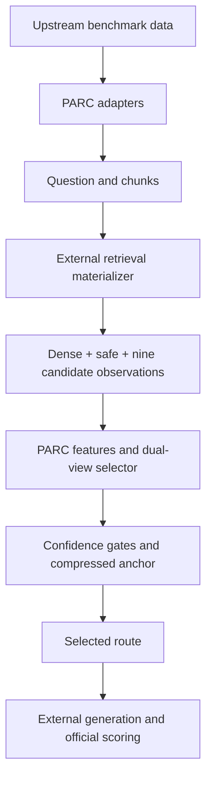

# PARC: Prediction-Free Adaptive Routing and Chunk Compression

[](https://github.com/anning945/PARC/actions/workflows/tests.yml)
[](LICENSE)

[English](#overview) | [中文说明](#中文说明)

PARC selects a compressed chunk-pool view for each retrieval-augmented
generation query, using retrieval observations rather than generated answers.
This repository releases the frozen router, benchmark adapters, synthetic
examples, and score-only experiment summaries.

## Contents

- [Overview](#overview)
- [Installation](#installation)
- [Quick start](#quick-start)
- [Datasets](#datasets)
- [Run on your retrieval observations](#run-on-your-retrieval-observations)
- [Reported results](#reported-results)
- [Repository structure](#repository-structure)
- [Troubleshooting](#troubleshooting)
- [Citation and license](#citation-and-license)
- [中文说明](#中文说明)

## Overview

PARC combines a nine-route compression portfolio, raw and relative retrieval
features, a frozen dual-view selector, confidence gates, and a compressed
Dense-order anchor. At inference, routing does not consume test answers,
generator outputs, quality scores, benchmark identities, or generator
identities. "Prediction-free" refers to these generator/evaluation inputs;
the learned selector itself still produces route scores.



| Component | Release status |
| --- | --- |
| Frozen selector, feature extraction, routing and checksums | Included |
| Four-family adapters and complete paper-inventory schema check | Included |
| CPU synthetic example and automated contract tests | Included |
| Task-level and quality/compression summaries | Included; not new evaluations |
| Retrieval materializer for all candidate routes | Not yet included |
| Generator runner and official-scoring orchestration | Not yet included |
| Selector training pipeline and independent full benchmark replay | Not yet included |

**This is a routing release, not a one-command reproduction of the paper's
F1 tables.** The quick start needs no GPU, dataset, API key, or generator
checkpoint. See [release boundaries](docs/release_boundary.md).

## Installation

Requirements: Git, Bash, Python **3.10.20**, and pip. Use Linux or macOS; on
Windows, run the shell scripts in WSL. GPU requirements depend on your external
retrieval/generation stack, not the routing example.

```bash
git clone https://github.com/anning945/PARC.git
cd PARC
conda env create -f environment.yml
conda activate parc-routing
```

Alternatively, with Python 3.10.20 already installed:

```bash
python3.10 -m venv .venv
source .venv/bin/activate
python -m pip install -r requirements-benchmark.txt
```

Routing uses NumPy 2.2.6, joblib 1.5.3, and scikit-learn 1.7.2. Adapters also
use pandas 2.2.3 and langchain-text-splitters 0.3.11.
`requirements-lock.txt` pins direct routing dependencies, not every transitive
package. Do not assume the frozen joblib model works with arbitrary
scikit-learn versions. Load only trusted model artifacts.

## Quick start

From the repository root, verify the release and run a synthetic routing query:

```bash
bash scripts/verify_parc_release.sh
```

This checks source and model hashes, runs the runtime self-test and unit
tests, and executes the frozen selector. A successful run ends with:

```text
PASS PARC release verification
```

Output: `outputs/synthetic_routing_output.json`, containing
`status: COMPLETE_RETRIEVAL_ONLY_ROUTING_V9`, `queries: 1`, the selected route,
and integrity metadata. It contains no generated answer or F1 score.

Run just the example, optionally choosing its output path:

```bash
bash scripts/run_parc_example.sh
bash scripts/run_parc_example.sh outputs/my_routing.json
```

With multiple Python installations, select the interpreter explicitly:

```bash
PYTHON=.venv/bin/python bash scripts/verify_parc_release.sh
```

The synthetic fixture is **not** paper evidence. Generated outputs are
ignored by Git; rerunning the example does not alter source files.

## Datasets

Download data from the authors' sources; datasets are not redistributed here.
Use the pinned versions and layout in [the dataset guide](docs/benchmarks.md).

| Benchmark family | Dataset download | Paper evaluation inventory |
| --- | --- | --- |
| BAMBOO | [Official dataset directory](https://github.com/RUCAIBox/BAMBOO/tree/f230f206148396c12774ef3a632df291d96dc6ab/datasets) | 4 hallucination-detection tasks; 800 scored units |
| ETHIC | [Hugging Face: dmis-lab/ETHIC](https://huggingface.co/datasets/dmis-lab/ETHIC/tree/34d9a5c6ffd9b06b1eca75d2e7a437bc96d628c4) | Recalling and Attributing; 995 scored units |
| HELMET | [Hugging Face: princeton-nlp/HELMET, original v1](https://huggingface.co/datasets/princeton-nlp/HELMET/tree/c5b85e7f0d954ffe71b3fe5b6d1da17a11094b1b) | KILT HotpotQA and PopQA; 3,843 scored units |
| LongTableBench | [Official dataset directory](https://github.com/liyaooi/LongTableBench/tree/8db45ac102632cba3bcc1393e1023f0689da7d1c/datasets) | 42 format/length/turn configurations; 12,397 scored units |

No author-confirmed Hugging Face or ModelScope mirror has been verified for
the BAMBOO and LongTableBench revisions used here. We provide official GitHub
data links instead of unverified or similarly named datasets.
HELMET v2 is not interchangeable with the pinned v1 archive.

The paper inventory has **50 tasks, 12,309 record/conversation evaluations,
and 18,035 scored units per method**. This does not cover every task in each
upstream benchmark. LongTableBench configurations reuse questions across
formats; scored units are not unique source questions.

After arranging the files locally, check the complete paper inventory:

```bash
bash scripts/run_parc_schema_check.sh
```

Expected: `status: PASS`, with reports under `outputs/parc_schema_check/`.
This is a schema/inventory check, not an F1 evaluation. The
[step-by-step workflow](docs/reproduction_workflow.md) explains custom paths,
selector-only export, and the remaining external stages.

## Run on your retrieval observations

Supply a nonempty JSON list of query objects with exactly `query_key`,
`question`, `chunks`, and `methods`. Each `methods` object must contain Dense,
the safe compressed route, and all nine candidate routes with their chunk
indices and retrieval scores. See the [input contract](docs/public_input_schema.md),
[synthetic input](examples/parc_synthetic_task_input.json), and
[route configuration](configs/parc_policy.json).
A selector stub alone still needs retrieval observations before routing.

```bash
python src/parc_router/parc_runtime.py \
  --model artifacts/parc_selector/parc_frozen_selector.joblib \
  --task-input /path/to/query_group_with_methods.json \
  --output outputs/routed.json
```

The output identifies the selected method for every query. Reconstruct the
generator input using that method's retrieved indices and the adapter's
prompt renderer. Generation and scoring must be supplied separately.

## Reported results

These **Qwen2.5-7B-Instruct** operating points come from the
[released summary](results/parc_quality_compression_pareto_verified.csv), not
the quick start. F1 is the unweighted macro over all 50 tasks, on a 0-1 scale.

| Method | Macro F1 | Mean chunk compression |
| --- | ---: | ---: |
| Dense | 0.45154 | 0.00% |
| Fixed safe route | 0.45142 | 53.09% |
| Fixed RRF | 0.46947 | 53.09% |
| PARC | 0.46099 | 56.50% |

PARC improves aggregate F1 over Dense while compressing every scored unit
(18,035/18,035). It does not have the highest F1 among these operating points.
Compression measures the fraction of unique candidate chunks removed,
averaged over scored units, not token, disk-space, or latency savings.
The [complete task table](results/parc_task_quality_verified.csv) retains both
positive and negative deltas. `results/parc_release_summary.json` records a
historical audit, not an independent end-to-end replay of this GitHub checkout.

## Repository structure

```text
PARC/
  artifacts/parc_selector/    Frozen model, manifest, artifact hashes
  configs/                   Route policy and example dataset layout
  docs/                      Dataset sources, input contract, workflow
  examples/                  Synthetic retrieval-only input
  results/                   Score-only experiment summaries
  scripts/                   Examples, schema checks, release verification
  src/parc_benchmarks/        Four-family adapters and prompt renderers
  src/parc_router/            Feature extraction and frozen routing runtime
  tests/                     Adapter, routing and integrity tests
  .github/workflows/          Clean-checkout continuous integration
```

## Troubleshooting

| Symptom | What to check |
| --- | --- |
| Wrong Python or scikit-learn version | Activate `parc-routing`, or set `PYTHON` to the documented interpreter. |
| SHA256 mismatch after editing | Expected for a modified checkout. Compare with Git; see the maintainer checksum instructions. |
| Missing files or inventory mismatch | Check dataset revisions and root paths. Do not substitute a small sample or HELMET v2. |
| `methods` missing or forbidden field rejected | Follow the input contract; keep answers, identities and quality scores outside selector input. |
| Joblib model cannot load | Use the exact dependencies, bundled model and sibling manifest. Do not disable hash checks. |
| No F1 score after the example | Expected: the example runs routing only, not an LLM. |

For network restrictions, configure your own `HTTPS_PROXY`/`HTTP_PROXY`
before downloading data. No proxy, token, or server address is hard-coded.
File issues with the commit, environment versions and a minimal synthetic
example, without private data or credentials. See [contributing](CONTRIBUTING.md)
for tests and checksum maintenance.

## Citation and license

Use [CITATION.cff](CITATION.cff) for software citation, record the exact commit,
and cite each benchmark's original work. No conference acceptance is implied.

PARC code uses the [MIT License](LICENSE). Datasets and external checkpoints
retain their own licenses. We do not include raw benchmark data, test answers,
formal generations, private logs, credentials, or generator/retriever weights.

## 中文说明

### 项目概览

PARC 为每个 RAG 查询选择压缩后的 chunk 池视图，结合九种候选路由、
原始与相对检索特征、冻结的双视图选择器、置信度门控和压缩 Dense 顺序锚点。
推理时不读取测试答案、生成结果、F1、benchmark 身份或生成模型身份。
“Prediction-free”指不依赖生成与评测结果，不是说选择器不计算路由分数。

已公开冻结模型、路由源码、四族数据适配器、合成样例、测试和实验汇总。
**当前是路由阶段的开源版本，不是一键复现论文全部 F1 的完整流水线。**
候选检索构建、生成与官方评分编排、选择器训练以及独立全量复跑尚未公开完成。

### 安装与运行

使用 Python 3.10.20。合成样例只需 CPU，不需数据集、LLM 或 API。
支持 Linux/macOS，Windows 建议使用 WSL。

```bash
git clone https://github.com/anning945/PARC.git
cd PARC
conda env create -f environment.yml
conda activate parc-routing
bash scripts/verify_parc_release.sh
```

成功时输出 `PASS PARC release verification`，结果写入
`outputs/synthetic_routing_output.json`，包含所选路由和校验信息，不包含答案或 F1。
只运行样例可执行 `bash scripts/run_parc_example.sh`。
也可用 Python 3.10.20 创建虚拟环境，安装 `requirements-benchmark.txt`；
多环境时用 `PYTHON=.venv/bin/python` 指定解释器。冻结模型依赖固定版本，
不要加载来源不明的 joblib 文件。合成样例和自动测试不是论文实验。

### 数据集与复现步骤

数据不放进仓库，直接从作者来源获取：

| Benchmark | 下载入口 | 本文评测范围 |
| --- | --- | --- |
| BAMBOO | [官方数据目录](https://github.com/RUCAIBox/BAMBOO/tree/f230f206148396c12774ef3a632df291d96dc6ab/datasets) | 4 个任务，800 个评分单元 |
| ETHIC | [Hugging Face](https://huggingface.co/datasets/dmis-lab/ETHIC/tree/34d9a5c6ffd9b06b1eca75d2e7a437bc96d628c4) | Recalling、Attributing，995 个评分单元 |
| HELMET | [Hugging Face 原始 v1](https://huggingface.co/datasets/princeton-nlp/HELMET/tree/c5b85e7f0d954ffe71b3fe5b6d1da17a11094b1b) | HotpotQA、PopQA，3,843 个评分单元 |
| LongTableBench | [官方数据目录](https://github.com/liyaooi/LongTableBench/tree/8db45ac102632cba3bcc1393e1023f0689da7d1c/datasets) | 42 个配置，12,397 个评分单元 |

BAMBOO 和 LongTableBench 暂未核实到与本文版本对应的作者认可的
Hugging Face/ModelScope 镜像，因此保留官方 GitHub 入口，避免同名数据误用。
HELMET 必须用固定 v1，不能直接换成 v2。

1. 按[数据与版本说明](docs/benchmarks.md)下载并放置文件。
2. 执行 `bash scripts/run_parc_schema_check.sh` 检查本文完整评测清单。
3. 用外部检索实现补齐 Dense、安全路由和九种候选路由的检索观测。
4. 按[输入格式](docs/public_input_schema.md)调用 PARC，得到每个查询的路由。
5. 单独运行生成模型及官方评分器，详见[复现流程](docs/reproduction_workflow.md)。

本文清单共 50 个任务、12,309 次记录/对话评测、每种方法 18,035 个评分单元，
不代表覆盖上游所有任务，也不代表有 18,035 个不重复原始问题。
schema 检查通过只说明数据结构与清单通过检查，不能替代正式 F1 评测。

### 已有结果与边界

公开 Qwen 汇总中，PARC 的 50 任务宏平均 F1 从 Dense 的 0.45154 提高到
0.46099，平均移除 56.50% 的候选 chunk，所有评分单元均压缩。
Fixed RRF 的 F1 为 0.46947、压缩率为 53.09%，因此不声称 PARC 的 F1 最高。
上方英文表格列出相同数值，[逐任务结果](results/parc_task_quality_verified.csv)
保留提升与下降。压缩率按唯一候选 chunk 计算，不等于 token、磁盘或时延节省。

校验失败先检查本地文件改动，模型加载失败先核对依赖版本；不要关闭校验，
或用部分样本替代完整评测。软件采用 MIT，数据与模型分别遵守上游许可证。
引用见 `CITATION.cff`；反馈问题请附提交版本、环境和合成样例，不要上传凭据或私有数据。
